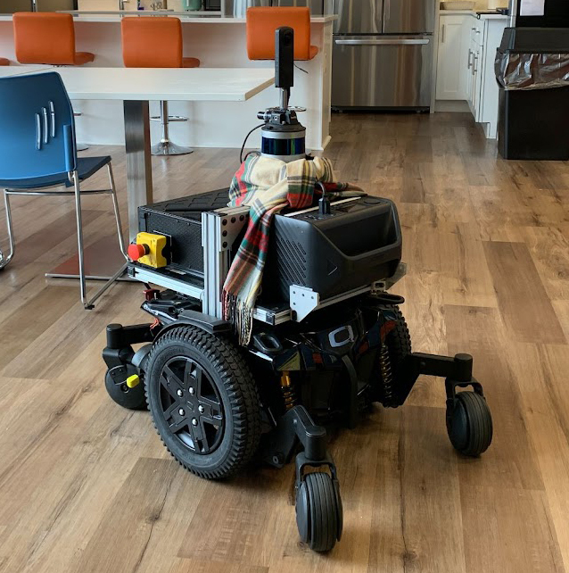

## Introduction

This is a 3D open-vocabulary instance-level semantic mapping system. The system takes stamped panoramic images, 3D LiDAR scans, and odometry as inputs. The outputs are 3D instance-level object centroids and 3D bounding box estimates. The system uses [Grounded-SAM-2](https://github.com/IDEA-Research/Grounded-SAM-2) for open-vocabulary object detection and segmentation on images, and manages the 3D object clustering, tracking, and filtering to provide a 3D object-level map, aiming to provide a real-time and easily adaptable spatial representation for language navigation and other upstream tasks. Below are the sensor setups we have tested. Left: Livox-Mid360 + Ricoh Theta Z1 Camera; Right: Velodyne VLP-16 + Ricoh Theta Z1 Camera.

<p float="center">
  
  
</p>


## Repository Setup

This repository contains the code for semantic mapping with 360 (panoramic) camera and 3D LiDAR. The system has been tested with the following robot/sensor setups:
[mecanum_wheel_platform](https://github.com/jizhang-cmu/autonomy_stack_mecanum_wheel_platform.git), [wheelchair_platform](https://www.ai-meets-autonomy.com/cmu-vla-challenge).


### Requirements

1. GPU with >16GB memory
2. Miniforge install is required for setting up ROS. Follow the install instructions [here](https://github.com/conda-forge/miniforge).

### Setup the environment

First create the environment:

``` bash
conda create --name mapping_ros1 python=3.11
conda activate mapping_ros1
```

To make ROS accessible in the environment, install ROS/ROS2 using robostack:
```bash

# this adds the conda-forge channel to the new created environment configuration 
conda config --env --add channels conda-forge
# and the robostack channel
conda config --env --add channels robostack-noetic

# remove the defaults channel just in case, this might return an error if it is not in the list which is ok
conda config --env --remove channels defaults

# Install ros-noetic into the environment (ROS1)
mamba install ros-noetic-desktop

conda deactivate
conda activate mapping_ros1
```

Install Grounded-SAM-2:
```bash
pip install torch==2.5.1 torchvision==0.20.1 torchaudio==2.5.1 --index-url https://download.pytorch.org/whl/cu124
conda install cuda -c nvidia/label/cuda-12.4.0
export CUDA_HOME=$(dirname $(dirname $(which nvcc)))

cd external/
git clone https://github.com/IDEA-Research/Grounded-SAM-2.git
pip install Grounded-SAM-2/grounding_dino/
pip install Grounded-SAM-2
pip install transformers
```

Install the customized byte_track and cython_bbox in `external` folder:
```bash
# install customized external libraries
pip install byte_track cython_bbox
```


Install other dependencies
```bash
pip install supervision open3d spacy rerun-sdk
python3 -m spacy download en_core_web_sm
```

Finally, install the semantic mapping package:
```bash
cd ../
pip install . # Install semantic_mapping package
```

## Run
**First**, make sure the following topics are available:

| Topic Name        | Message Type            | Note                                      |
| ----------------- | ----------------------- | ----------------------------------------- |
| /registered_scan  | sensor_msgs/PointCloud2 | Registered point cloud in the world frame |
| /camera/image     | sensor_msgs/Image       | 360 Images                                |
| /state_estimation | nav_msgs/Odometry       | Odometry of the LiDAR frame               |

If you need to change the topic names you subscribe to, please check the topic subscriptions [here](https://github.com/gfchen01/semantic_mapping_with_360_camera_and_3d_lidar/blob/ros1/semantic_mapping/mapping_ros1_node.py#L181-L205).

**Second**, check the configs. Here is an example config:

```yaml
platform: wheelchair # name of the platform. Implies extrinsics.

use_lidar_odom: false # If set true, the LiDAR odometry named /aft_mapped_to_init_incremental should be provided, which is a lower frequency but more accurate odometry from the LiDAR SLAM

detection_linear_state_time_bias: -0.05 # Compensation on the camera odometry estimate of linear states

detection_angular_state_time_bias: 0.0 # Compensation on the camera odometry estimate of angular states

image_processing_interval: 0.5 # Period in which the semantic inference and mapping are performed

visualize: true # If set true, a Rerun window spawns for visualization

vis_interval: 0.5 # Period in which map is visualized

annotate_image: false # if set true, 2D images with annotated semantic masks and LiDAR projections will be saved

# prompts 
prompts:
    chair:
    prompts: # prompts that actually goes to DINO
      - chair
    is_instance: true # Whether the object should be treated as instance-level
  sofa:
    prompts:
      - sofa
    is_instance: true
  table:
    prompts:
      - table
    is_instance: true
  wall:
    prompts:
      - wall
      - white wall
      - blue wall
      - black wall
    is_instance: false
```

**Then**, you can either run in simulation or real-world system (rosbag).

### Run with simulation

First, setup the simulated base system following the instructions here: [wheelchair_platform](https://www.ai-meets-autonomy.com/cmu-vla-challenge).

After running `system_bring_up.sh`, you should see an Rviz like this:


Also the Unity simulation environment like this:


```bash
# wheelchair platform
python -m semantic_mapping.mapping_ros1_node --config config/mapping_wheelchair.yaml
```
When the ros node runs stably, you can start operating the simulation. You should see a rerun visualization like this:


### Run in real-world

An example bag recorded with [wheelchair_platform](https://www.ai-meets-autonomy.com/cmu-vla-challenge) on real-world system can be downloaded [here](https://drive.google.com/file/d/1FRn78MsMIxIS4pyMwQLpWWVZMcEndmfk/view?usp=drivesdk). After downloading the bag, start the ros node with `python -m semantic_mapping.mapping_ros1_node --config config/mapping_wheelchair.yaml`, then play the rosbag with `rosbag play sqh_2.bag`. You should be able to see the visualized map in Rerun window.

<figure style="text-align: center;">
  
  <figcaption style="text-align: center;">Rerun visualization of Mapping Result in 3D</figcaption>
</figure>

<figure style="text-align: center;">
  
  <figcaption style="text-align: center;">One frame of aligned Depth/Image/Semantics Input</figcaption>
</figure>


## Credits

Contributors: [Guofei Chen](https://gfchen01.github.io), [Changwei Yao](https://github.com/chadwick-yao), [Ji Zhang](https://frc.ri.cmu.edu/~zhangji/).

[Grounded-SAM-2](https://github.com/IDEA-Research/Grounded-SAM-2), [byte_track](git@github.com:ifzhang/ByteTrack.git), and [cython_bbox](git@github.com:samson-wang/cython_bbox.git) are from open-source releases.

